# Clockout

For years, analog clocks have been wasting time. Toiling away 24/7, they're only really appreciated for their hard work a few seconds a day when somebody is finally able to spare a brief glance. Sounds horribly inefficient? It is. Luckily, there's Clockout. Clockout is an analog clock that only updates to the current time when somebody looks at it. Now you may ask, is this really more energy efficient? Thanks to the near constant processing to look for people, no. But is it cheaper than a regular clock? Not at all, it uses over $100 in components. However, does it perform better than a regular clock? Definitely not, although it does do decently well. For all its weaknesses, it blows away its competition in only one field. It's slightly funny.

When a user walks into the room in front of the clock, an IR motion detector recognizes their movement. This is sent to a Raspberry Pi, and a blue LED illuminates to let the user know they're seen. The Pi then uses a Pi Camera to try and pick out a face. If this is successful, another indicator LED lights up before the hands adjust. The Pi pulls the real time (internet connected) and adjusts the hands to that time using a stepper motor connected to a gearbox. The entire system is powered off of a laptop power supply, which is stepped down to 5V for the Pi. 12V is pulled off this buck board for the stepper. 

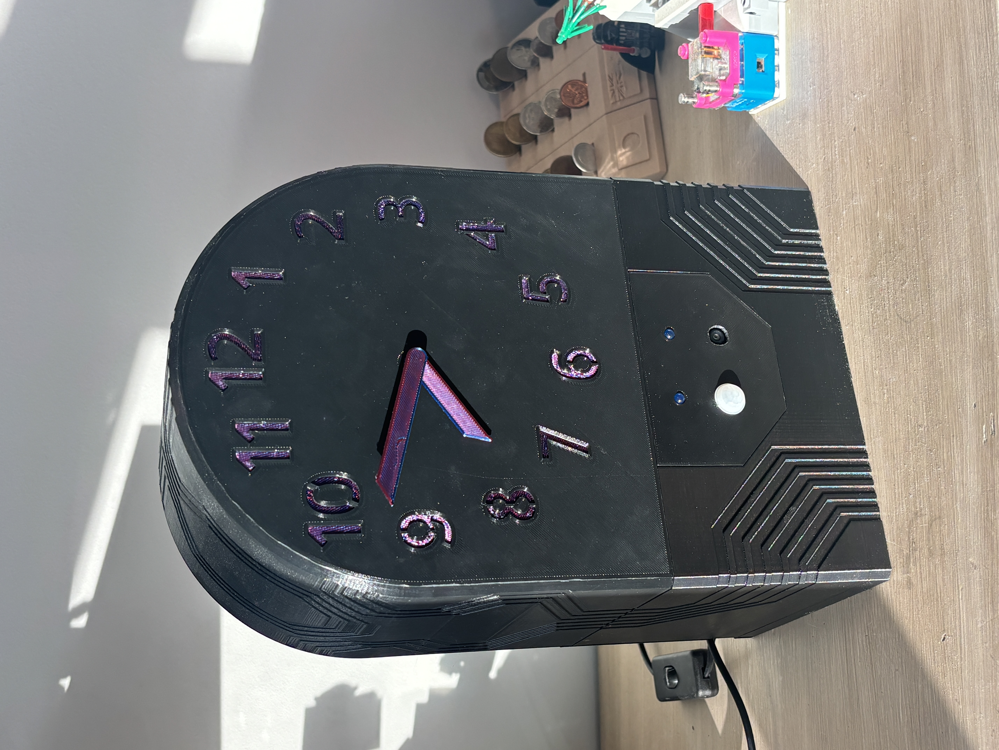

This repository contains the software and hardware specs (STLs, BoM) that I used to make this project. Note that this is not a reproduction friendly project. You're welcome to use this idea, or even some of the resources here, but know that there are probably better options/designs out there.

## Software

Software for this project is a series of Python scripts. When running the primary script for full operation, functions from each script are used. Each individual script has a nameguarded section useful for testing it independantly.

### main.py

The main running file. This script handles all of the peripheral scripts, as well as handles the "state machine" and the hand adjustment math. 

#### Running the script
To run this script, use the following command:
"nohup python3 main.py 0630"

This runs the script indefinitely, even after disconnecting SSH. The argument (0630 in this case) should be the position of the clock hands when you run the script (6:30). See "calibrate.py" for positioning. To end the script, use the following two commands:
"ps aux | grep main.py"
"kill 4204"

Replace 4204 with the process ID discovered by the first command.

#### State machine

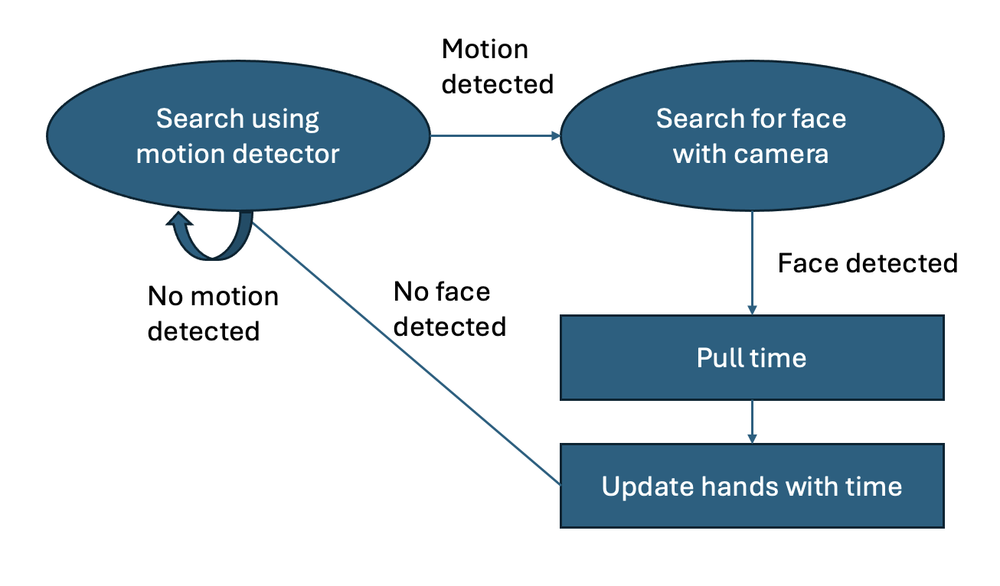

#### Clock hands math

This was one of the most technically challenging parts of the project surprisingly. It isn't all that complicated, but is hard to wrap your head around and hard to test (real time). This code finds the shortest distance in degrees between the current hands position and the desired position, then moves there.

### calibrate.py

This script allows the user to adjust the position of the hands. Enter a 4 digit number to exit. This is useful for testing, or if you'd like to line up the hands with a round time before starting for accuracy.

### camera.py

This script interacts with a Raspberry Pi PiCamera3 Wide Angle camera. It can take pictures, and detect faces in those pictures. Detection is done using a Haar cascade. A face is only registered when looking directly at the camera. Some tuning intructions are available in the comments. 

Watch out for the autofocus on this camera, if anything touches the lense area, it can mechanically block the autofocus, which causes problems for face detection.

### led.py

Dead simple script for toggling LEDs. Essentially a wrapper. 

### motion_detector.py

While this motion detector should probably be read using an ADC, it works pretty well as a digital read. This script simply takes that read.

### stepper.py

Controls the NEMA style stepper motor which spins the clock hands.

## Hardware

This section includes the component choices used in this project and the design of 3D printed components to house everything.

### BoM

See the BoM (excel sheet) in this repository. Note that the components used here are extremely overkill, and are still flawed. While I originally planned to use a Pi Zero 2W, the 4B offered easier development. The NEMA stepper is overkill in terms of power, and lacks any way of knowing its absolute position (a major flaw to this project). An ADC should really be used to read the motion detector, but digital worked fairly well, so I didn't. 

Many of the parts used were things I already had. I can't be bothered to go find out exactly what they are, you'll manage.

### Electronics Assembly

I avoided soldering to the Raspberry Pi, as it's quite expensive. Instead I used Arduino style jumpers, soldered to the other components with shrink wrap. For the stepper driver, I added a JST style connector. This allows me to more easily disconnect the top and bottom halves of the clock. 

All the electronics fit in quite poorly, largely because of long loose wires. The buck-Pi USB connection is especially troublesome, as the wire is stiff. Thankfully I had lots of space, and did lots of jamming.

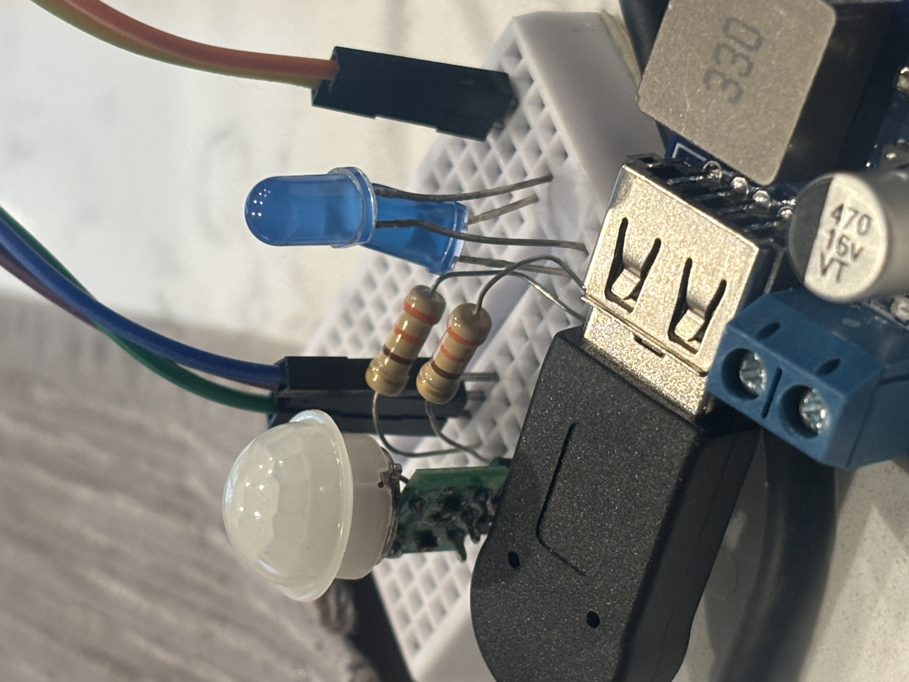

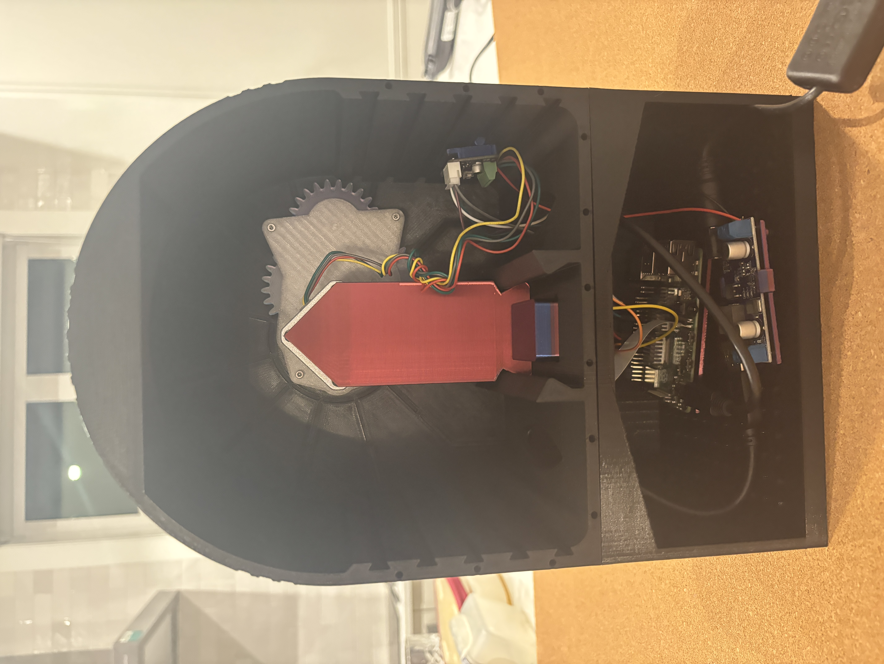

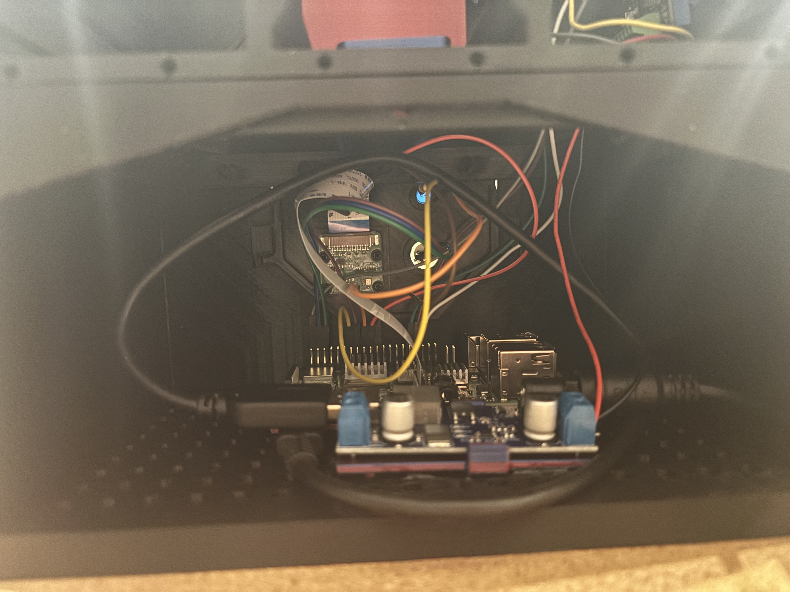

### 3D prints

All prints were done on a Prusa MK3S+ FDM printed. Almost all parts were printed in PLA, with the exception of the small gear on the stepper shaft which drives the gearbox. Since this is a high stress friction fit, PETG was used to prevent expansion over time. All files are available in the STLs folder. I make no claim to good designs. Some manual GCode editing was done to print the clock numbers in a different colour with two manual colour changes.

There was an attempt to make a nice modular system for mounting. This largely failed, as the parts weren't stiffly constrained enough for my jam-it-all-in assembly job.

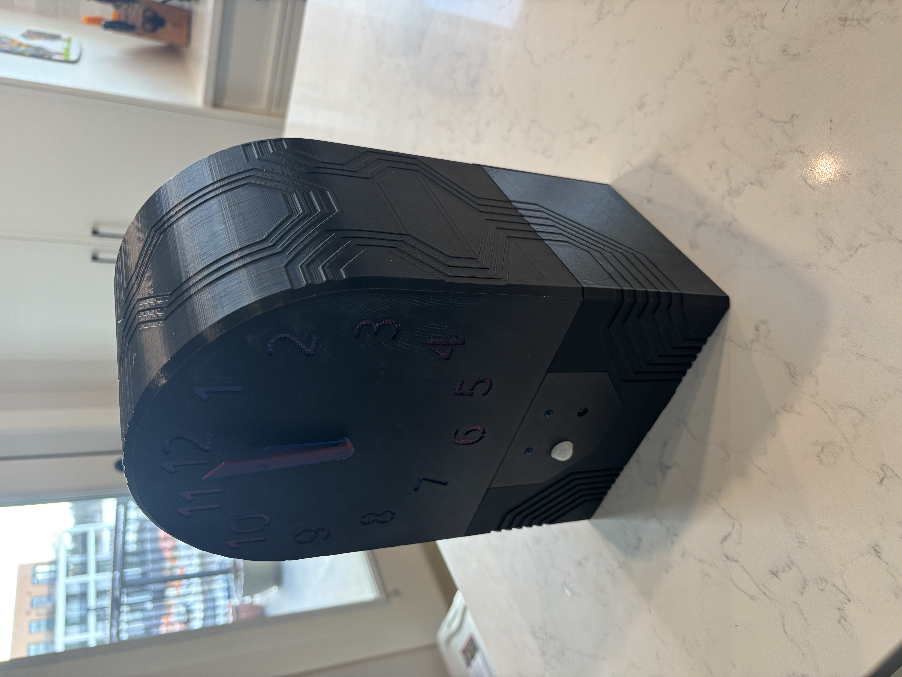

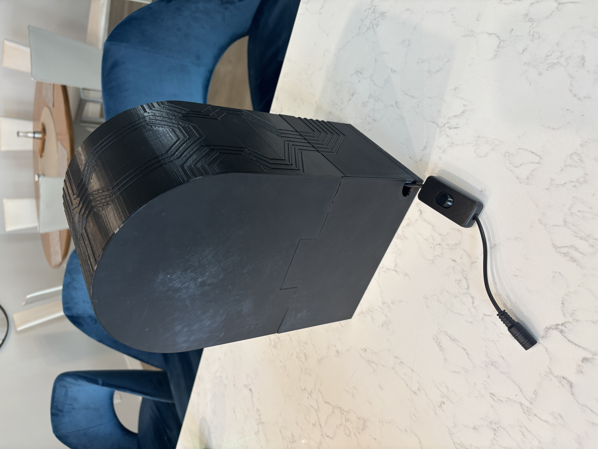

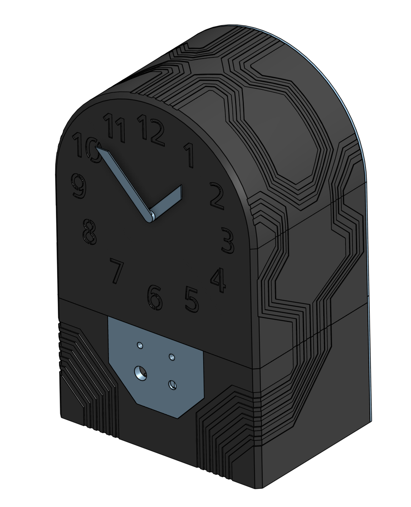

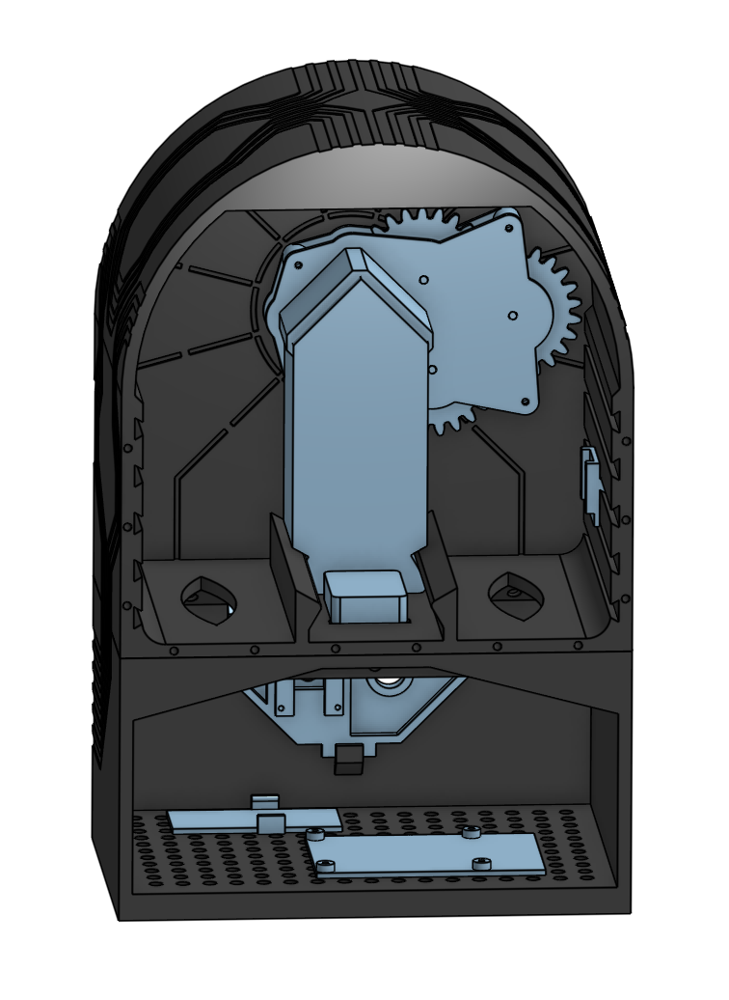

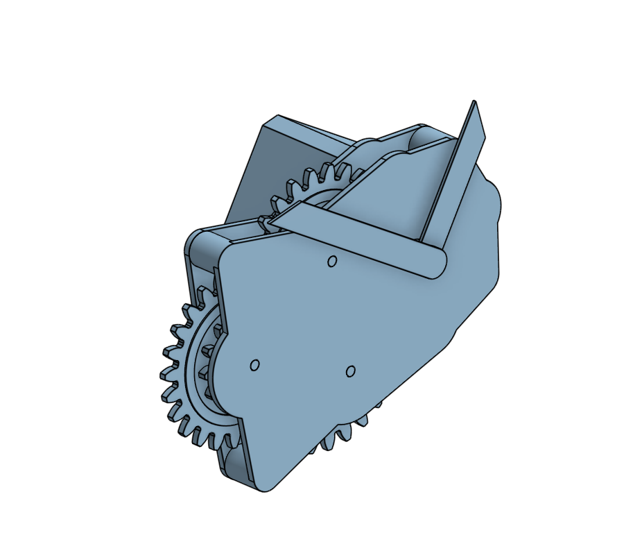

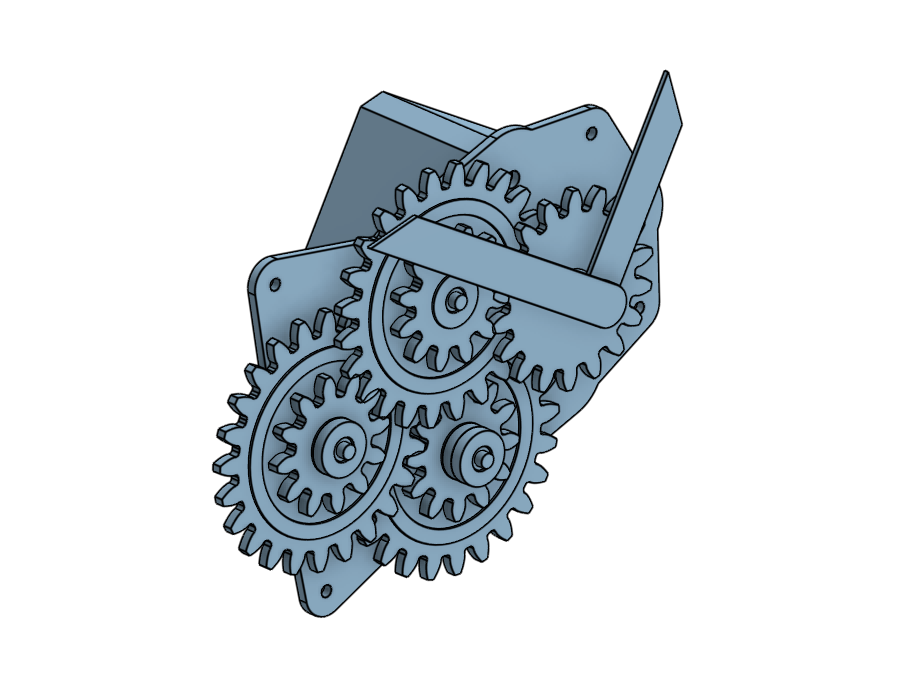
